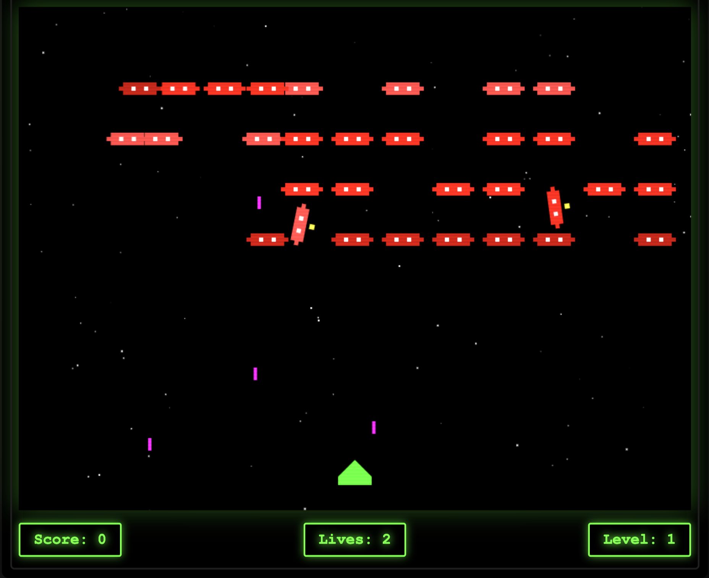

# Space Invaders

A retro arcade-style Space Invaders game built with HTML5 Canvas, CSS3, and vanilla JavaScript.



## Play Online

[Play here](https://concuben.github.io/SpaceInvaders)

## Features

- Classic Space Invaders gameplay with a 4×8 enemy formation
- Enemy swoop attacks using Bezier curves
- Particle explosion effects
- Sound effects
- Retro arcade cabinet visual design with CRT scanline effects
- Progressive difficulty — enemies speed up as you defeat them

## Controls

| Key | Action |
|-----|--------|
| Arrow Left / A | Move left |
| Arrow Right / D | Move right |
| Spacebar | Shoot |

## Run Locally

No build step required. Open `index.html` in any modern browser, or serve it locally to enable audio:

```bash
python3 -m http.server 8000
```

Then visit `http://localhost:8000`.
